Docker

Docker -setup\
Total 10 containers using.\
\
5 Microservices\
3 Databases\
1 Cache server\
1 Messaging server\
\
\
Different Api usage

UI \> WebUI\
Catalog API \> MySQL DB store product related information.\
Carts API \> DynamoDB store cart related information.\
Checkout API \> Cache \> Redis (Address information which address to be
delivered)\
Orders API \> SQL \> PostgreSQL DB store information and also store
information in RabbitMQ

Docker Concepts

1\) Docker Workflow:\
2) Docker Build:\
3) Docker Compose:\
\
\
\
Docker image in docker hub and want to pull and then run it.\
Docker build image and run the docker image, push image to docker hub.\
Docker Hub: Docker Pull and Run\
Docker image: Build, run, Push

Docker Command

Docker File instructions\
From:\
Run: Copy\
\
Volume\
WorkDIR\
ENV:\
User:\
Expose\
Exntrypoint:\
.dockerignore\
\
\
Multi Stage Build\
Docker Compose\
Service\
networks\
Volumes\
health checks\
depends on\
environment variables\
security options\
\
\
Show only running container\
Docker ps\
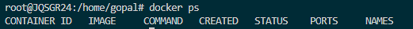

{width="5.427841207349081in"
height="0.3854702537182852in"}\
\
Check which container is running\
Also it's provide container id, image, command, Status, ports, and names
related information's.\
\
Docker ps -a: check all container 
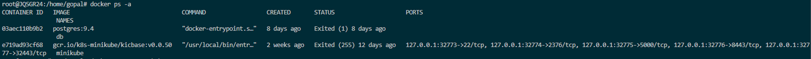

(including stopped/ Exited ones)\
{width="17.429515529308837in"
height="1.2814293525809275in"}\
\
docker rm \<container_id_or_name\> :\
Remove specific container\
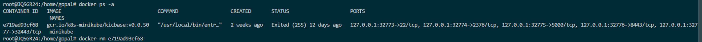

{width="17.544115266841644in"
height="1.083484251968504in"}\
\
Delete all stopped containers\
docker rm \$(docker ps -aq)\
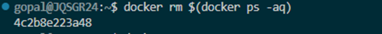
{width="4.313101487314086in"
height="0.3854702537182852in"}\
\
Remove all stopped containers\
docker container prune\
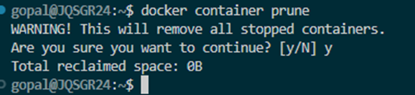
{width="3.958885608048994in"
height="0.9063768591426071in"}\
\
\
Remove a running container (force)\
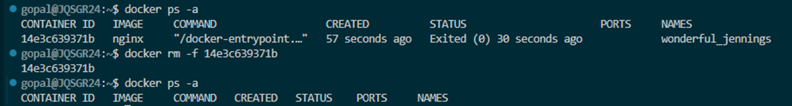
docker rm -f (container \_id_or_name)\
{width="9.470071084864392in"
height="1.271010498687664in"}\
\
docker images\
Showing information like repository , tag, Image ID, Created , Size.\
\
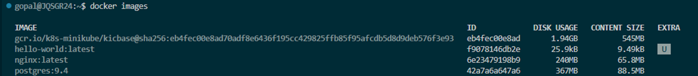
{width="11.480768810148732in"
height="1.250174978127734in"}\
\
docker rmi 
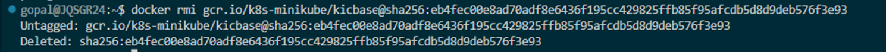
\<image_id\>\
remove specific image\
{width="9.928468941382327in"
height="0.5834142607174103in"}

Remove unused images\
docker image prune
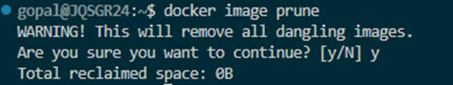

{width="3.8338681102362204in"
height="0.718850612423447in"}

Docker ps -aq\
showing only container id\
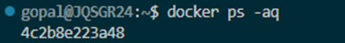
{width="2.9274923447069114in"
height="0.3646347331583552in"}\
\
remove all docker images\
docker rmi \$(docker images -a -q)
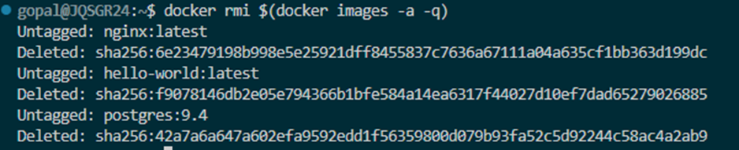

{width="6.250872703412074in"
height="1.271010498687664in"}

**Docker Terminology**\
\
Docker Client\
docker build\
docker run\
docker push\
docker pull\
\
\
Docker Host\
docker daemon: docker daemon is the background service that actually ru

ns docker.\
\
docker container\
docker images\
\
\
Docker Hub\
Docker pull\
docker run\
\
\
**Pull-from-Hub-and-Run-Docker-Image**\
docker images\

{width="4.844425853018373in"
height="0.6146686351706037in"}

Docker Pull image from docker hub\
docker pull stacksimplify/retail-store-sample-ui:1.0.0
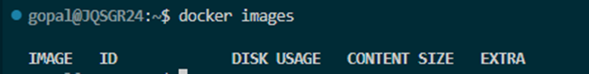

{width="6.448816710411198in"
height="2.166969597550306in"}\
\
docker images\
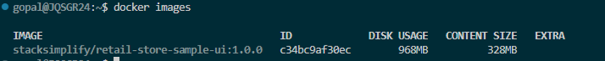
{width="7.438537839020123in"
height="0.7605227471566054in"}

Docker run container\
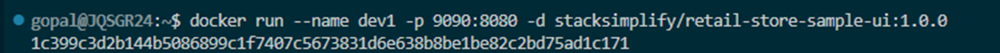
docker run \--name \<CONTAINER-NAME\> -p
\<HOST_PORT\>:\<CONTAINER_PORT\> -d \<IMAGE_NAME\>:\<TAG\>\
{width="7.803172572178478in"
height="0.41672462817147854in"}\
\
Container is in running mode\
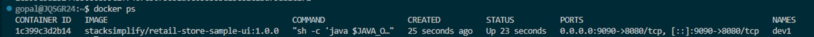
{width="12.855961286089238in"
height="0.5938331146106737in"}

UI access from web browser
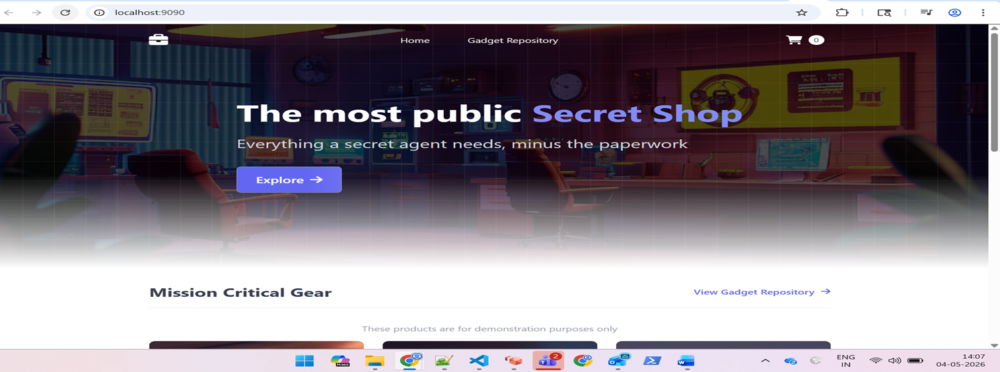
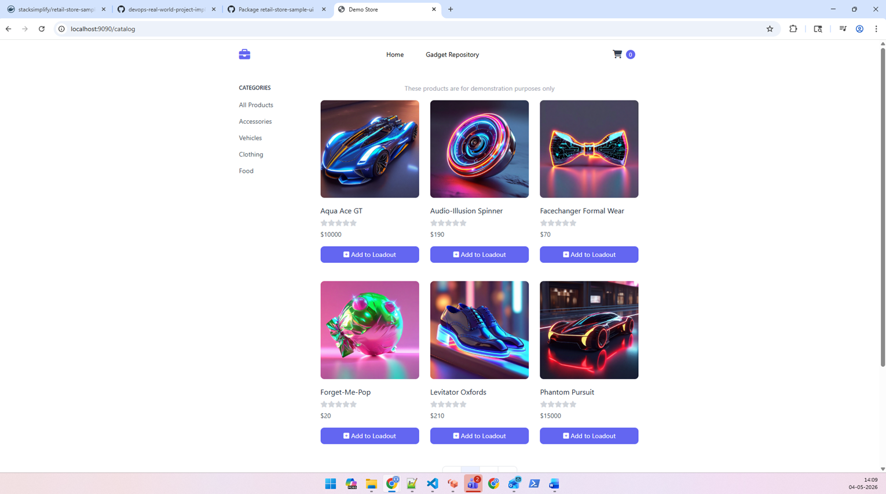
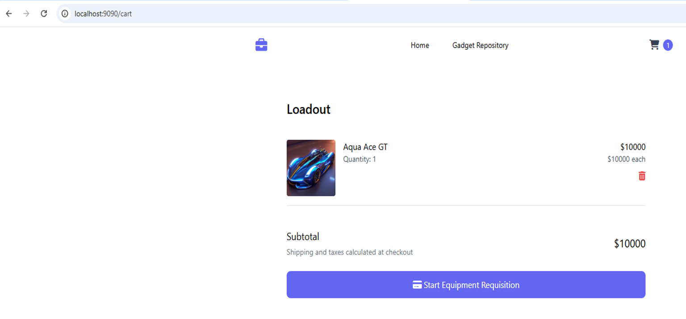
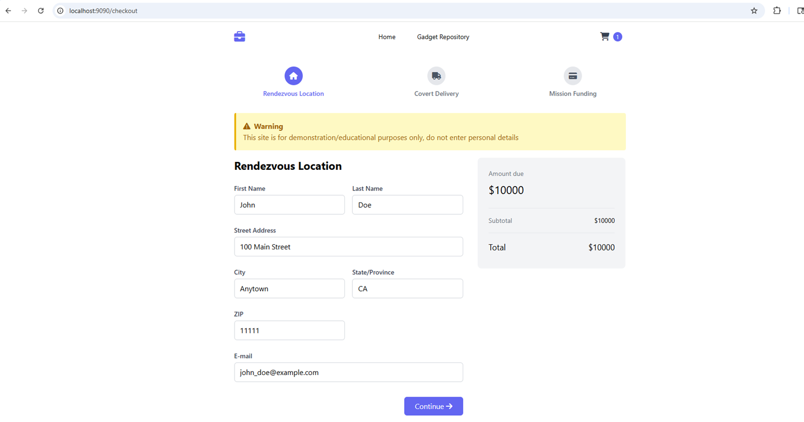
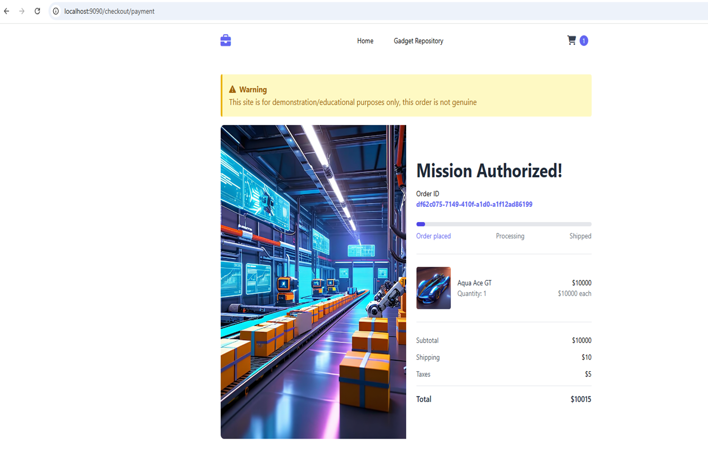
{width="10.09375in" height="3.7604166666666665in"}

{width="10.230916447944008in"
height="5.716354986876641in"}

{width="10.261154855643044in"
height="4.791776027996501in"}

{width="10.146510279965005in"
height="5.333688757655293in"}\
{width="9.948533464566928in"
height="6.354560367454068in"}

**Docker Command**\
\
Enter inside a running docker container use below command\
\
**docker exec**

Runs a command inside an existing running container

**-it**

Combination of two flags:

-i → interactive (keeps input open)

-t → gives a terminal (TTY)

docker exec -it dev1/bin/sh\
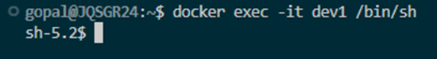
{width="3.667178477690289in"
height="0.5000699912510936in"}\
\
Inside container linux run below command to give kernel version\
uname -a\
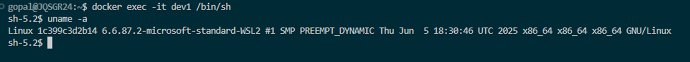
{width="10.16808617672791in"
height="0.9167946194225722in"}\
\
Run command in side container to check java version\
java --version\
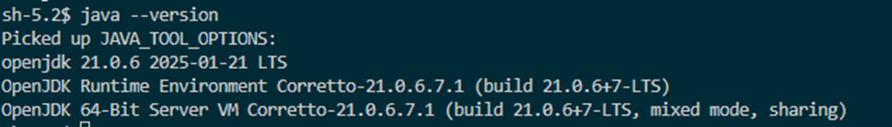
{width="6.61550634295713in"
height="0.9480489938757656in"}

From the host machine to run direct command to the container\
docker exec -it dev1 ls\
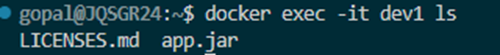
{width="3.333798118985127in"
height="0.3646347331583552in"}\
\
docker stop dev1\
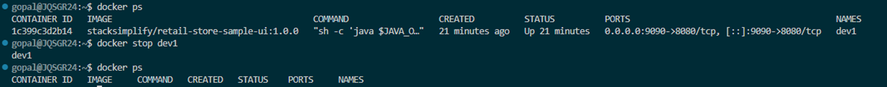
{width="12.866379046369204in"
height="1.271010498687664in"}

docker stop container and remove container\
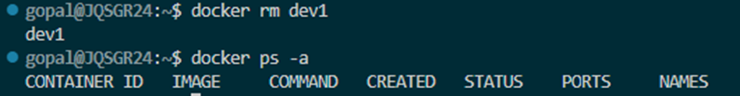
{width="5.532022090988627in"
height="0.718850612423447in"}\
\
docker image remove command\
docker rmi \< imageid\>\
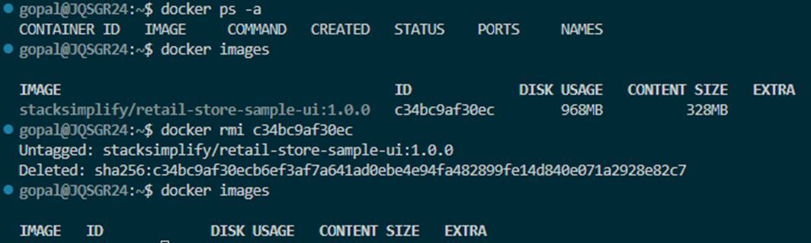
{width="7.094739720034996in"
height="2.135715223097113in"}

**Build-Docker-Image-Push-to-DockerHub**

How to build docker image and push to docker hub.\
\
Run docker login command and it will redirect to web browser.\
\
Enter code to the browser for login.\
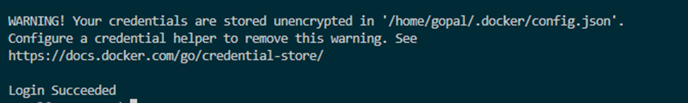
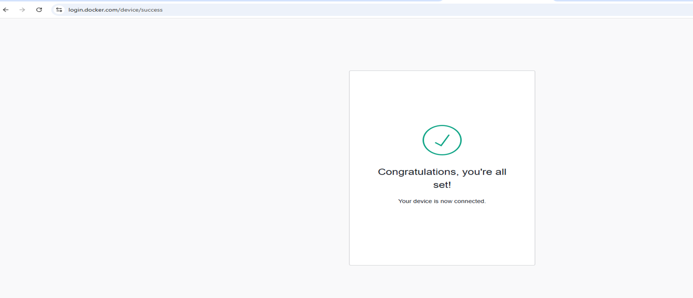
\
{width="7.000976596675415in"
height="1.0522298775153105in"}\
\
From web browser get below message.\
{width="9.80266404199475in"
height="4.219000437445319in"}\
\
\
\
** **Download the code for which Docker Image to be built**\
**mkdir demo-docker-build

wget
<https://github.com/aws-containers/retail-store-sample-app/archive/refs/tags/v1.5.0.zip>\
unzip v1.2.4.zip

d
/home/ec2-user/demo-docker-build/retail-store-sample-app-1.2.4/src/ui/src/main/resources/templates

File name: home.html

We are making a change for UI stating V2 at line\
List to Verify if we are at that file

ls home.html

ls -lrt\
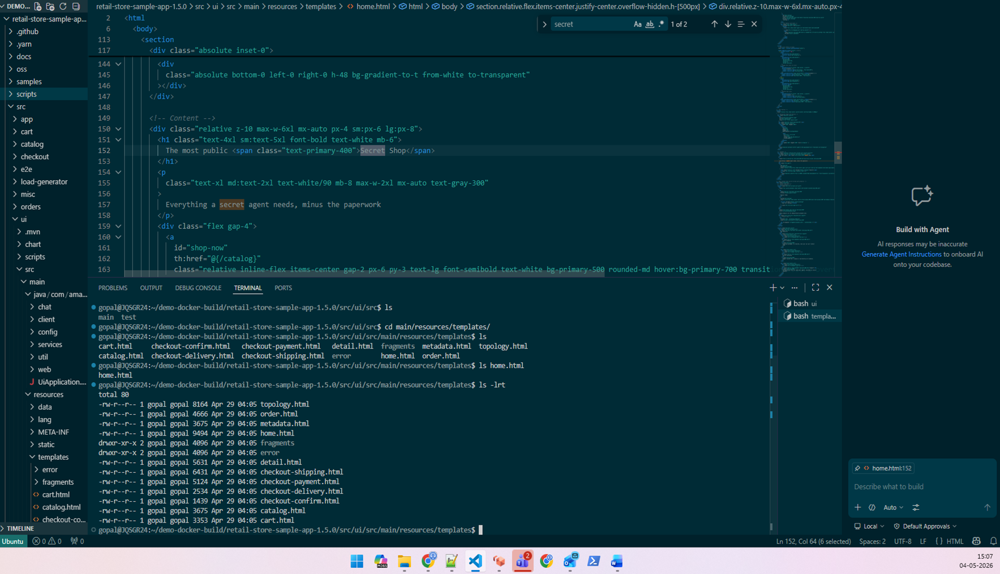
{width="11.786695100612423in"
height="6.774244313210849in"}

cd
/home/gopal/demo-docker-build/retail-store-sample-app-1.5.0/src/ui/src/main/resources/templates\
\
sed -i \'s/Secret Shop\<\\/span\>/Secret Shop - V2 Version\<\\/span\>/\'
home.html\
Verify It Worked:

grep \'Secret Shop\' home.html\
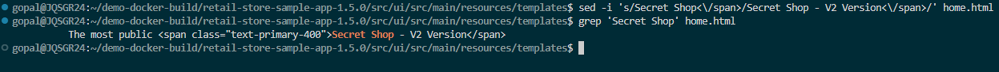
\
{width="12.991396544181978in"
height="0.9480489938757656in"}

Run docker build command to create image\
Go to the docker file location\
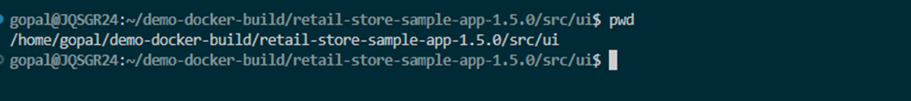
{width="7.9802799650043745in"
height="0.8855402449693788in"}\
\
Run build command to create image\
\
docker build -t retail-store-sample-ui:2.0.0 .\
!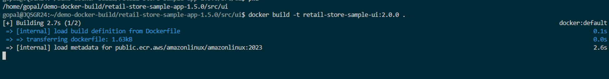
{width="13.001814304461941in"
height="1.7085717410323709in"}\
\
created new image\
docker images\
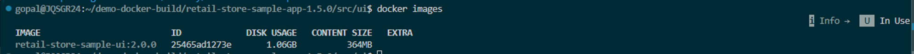
{width="13.262267060367455in"
height="0.8021948818897637in"}

Create new images run a container\
docker run \--name dev1-v2 -p 8889:8080 -d retail-store-sample-ui:2.0.0\
docker ps\
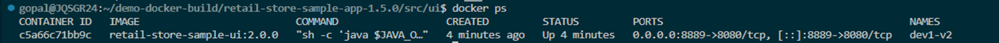
{width="13.251846019247594in"
height="0.5729965004374453in"}\
\
Version 2 is up and running.\
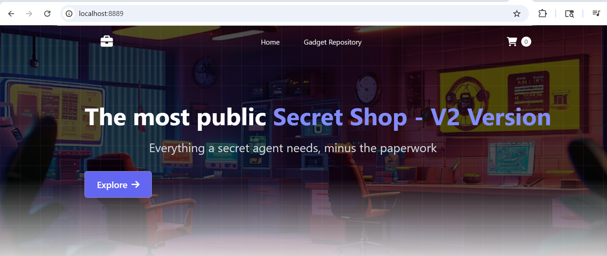
\
{width="13.375711942257217in"
height="5.646134076990376in"}\
\
**Tag and Push the Docker Image to Docker Hub**

docker tag retail-store-sample-ui:2.0.0 asd9955722/boot_camp:2.0.0\

{width="10.522302055993in"
height="1.2918471128608924in"}\
\
\
docker push\
docker push asd9955722/boot_camp:2.0.0\
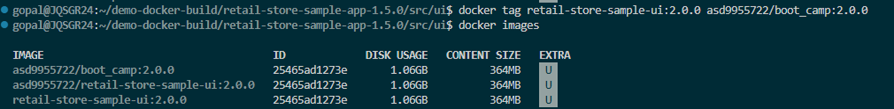
{width="8.699130577427821in"
height="1.9794433508311462in"}\
\
\
Verify the Docker Image on Docker Hub\
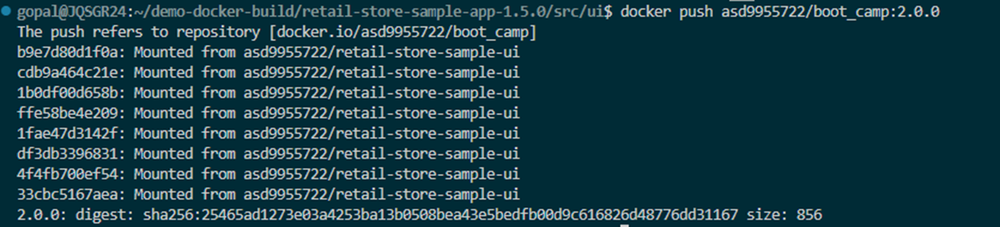
{width="13.07353893263342in"
height="5.052323928258968in"}
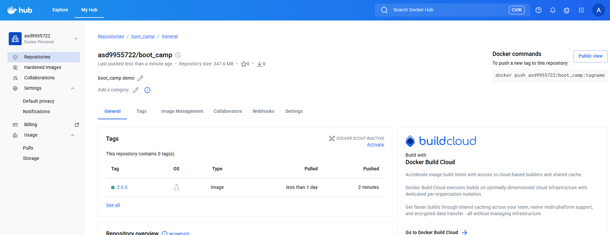