## Ingress 
- ingress is loadbalancer 
- Application lb is working on layer 7 and is work as path base, host base and header base routing.
## Load Balancer Controller
- it is bridge bitwin ingress and kubernetes cluster
- whenver we create service type of loadbalancer it will provision NLB.
- create ALB require permission so it called POD identity managment. Runs inside EKS nodes, Talks to AWS IAM, Gives temporary credentials to pods
- it will create service account, create iam role and policy.
- create EKS pod identity assocation. (Give IAM permissions directly to a Kubernetes pod securely)  Which pod/service account can access which IAM role.
- once PI is configured then controller get IAM role access.
- controller talk with AWS and create ALB. means it will have public DNS.
- Using DNS user can access and the request will come to this igress service and it will go to  your application it will using cluster ip or node port service.

## AWS Load Balancer Controller on EKS (with Pod Identity)
- Export Environment Variables
- IAM Role and Policy Setup
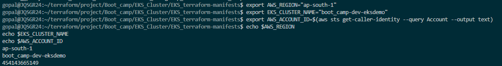

- Create IAM Policy for LBC
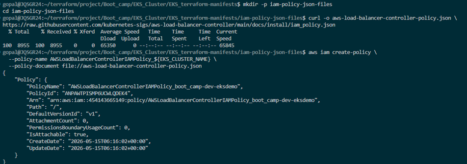
- Create Trust Policy File
- Create IAM Role and Attach Policy
- Create EKS Pod Identity Association
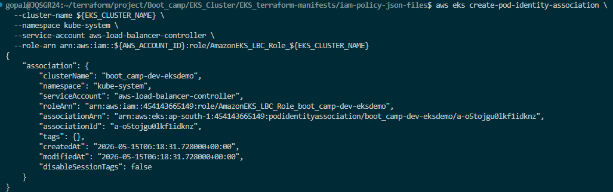
- Install AWS Load Balancer Controller (Helm)
- Install Load Balancer Controller
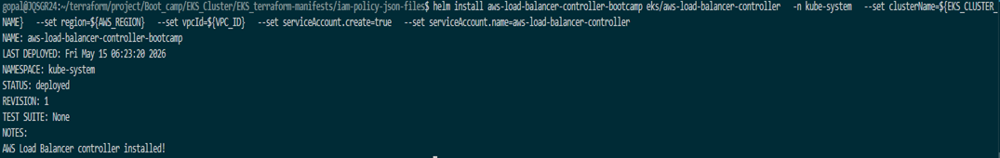
- Verify Helm Release
- Verify Controller Deployment
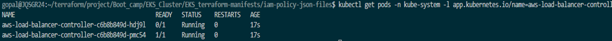
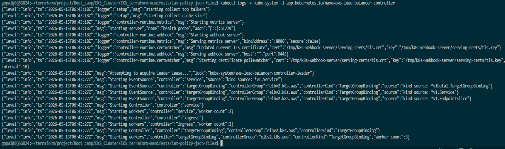


## Node port service 

## Ingress 
- ingress controller read ingress rules, route traffic to service and forwards requests to backend services based on host or path rules.
- each application have Target groups and target group have service and it could be service type cluster ip or node port.
- listener is a process in ALB that “listens” for incoming requests on a port (like 80/443) and forwards them to target groups based on rules.
- Routing is Sending user traffic to the right service based on rules like URL path or domain.

## Instance mode and Ip mode
- Instance mode traffice goes to node ip, Backend target is Ec2 instance.  
- Dont specified target when it default gos to instance mode.
```
User
 ↓
ALB
 ↓
EC2 Node:NodePort
 ↓
Kubernetes Service
 ↓
Pod
```

- IP mode Traffice gos to Pod ip
```
User
 ↓
ALB
 ↓
Pod IP directly
```
- Using ingress service and UI component that we can access all the other application. End point detail mentione in configmap.

## Deploy Ingress HTTP in both modes.

- Kubernetes Manifests (Ingress - HTTP)
- Deploy Ingress HTTP
```
kubectl apply -R -f kubernetes_ingress/
```
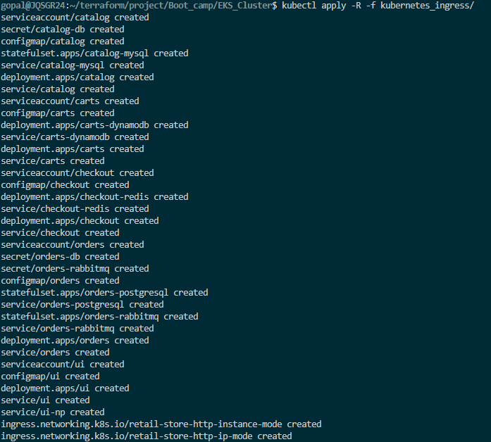


- Verify Ingress HTTP
```
kubectl get ingress -A
```
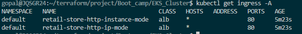

```
kubectl describe ingress retail-store-http-instance-mode
kubectl describe ingress retail-store-http-ip-mode
```

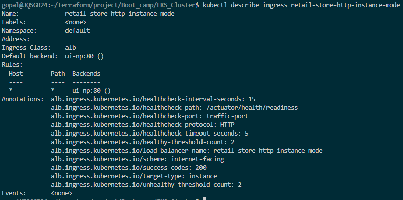
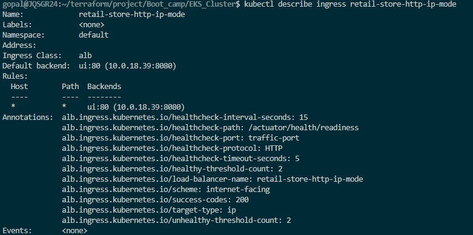

- ALB IP mode
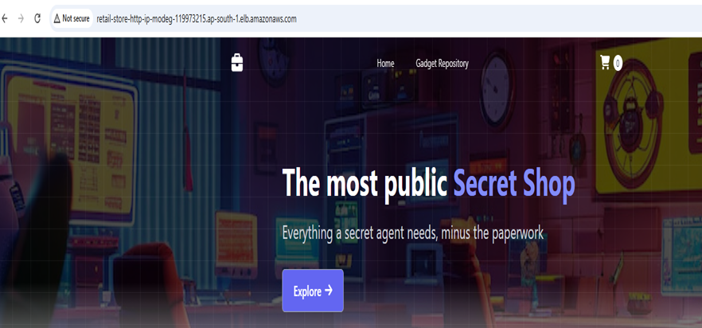

- ALB Instance Mode
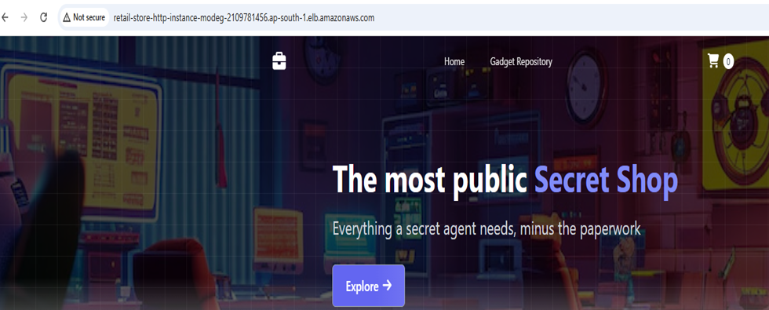


- Undeploy Ingress HTTP (prep for HTTPS)


## Deploy Ingress HTTPS
- Kubernetes Ingress - HTTPS (with ACM + Route53)
1) Create ACM cert + Route53 DNS.
2) Deploy HTTPS Ingress, test end-to-end.
3) Undeploy the resources after learning

- SSL Certificate (ACM) + DNS (Route53)
- Go to ingress_https_instance_mode.yaml file and thare is SSL settings. Need to update ssl certifcate arn. as well as define port (Listen port) in this file if not defian then it will take 80 port. SSL redirect Http to Https auto redirect seting.


- Kubernetes Manifests (Ingress - HTTPS)
- Deploy Kubernetes Ingress HTTPS
- Create DNS record (Route53)
- Route53 → stacksimplify.com, create CNAME:
- Verify Kubernetes Ingress - HTTPS

