Day -2
Docker Compose

Docker compose = simplified orchestration for microservice

Dependencies :
Compose supports ‘Depends_on’ and health checks to control startup order.

Health Checks:
Compose waits for services to become healthy before others start.

Centralised config:
All service settings -ports volumes, env vars – all in one YAML file.

Dev Lifecycle:
Test entire app locally
Tear down with ‘docker compose down’

Docker compose Structure

Name: retail-sample
networks:
services:
Capability add and capability drop Option use for security purpose.
Depends_on:

tmpfs:
/tmp:rw,noexec,nosuid 

Deploy docker compose retail store and verify
Create directory 
Download docker compose file using below link
wget https://github.com/aws-containers/retail-store-sample-app/releases/download/v1.5.0/docker-compose.yaml
Set Db password using export db_password command 
then verify it password set or not
echo $DB_PASSWORD

Then run docker compose up
 
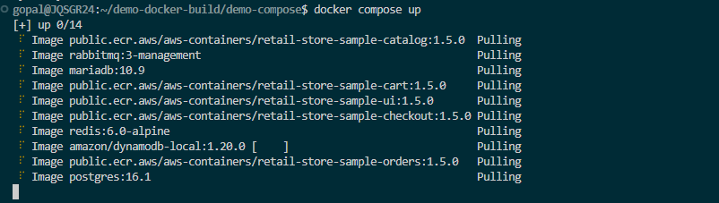

Getting error
Image public.ecr.aws/aws-containers/retail-store-sample-checkout:1.5.0 Error failed to resolve reference "public.ecr.aws/aws-containers/retail-store-sample-checkout:1.5.0": failed to authorize: failed ...       952.5s
Error response from daemon: failed to resolve reference "public.ecr.aws/aws-containers/retail-store-sample-checkout:1.5.0": failed to authorize: failed to fetch anonymous token: Get "https://public.ecr.aws/token/?scope=aws&scope=repository%3Aaws-containers%2Fretail-store-sample-checkout%3Apull&service=public.ecr.aws": read tcp 172.28.163.109:53034->75.2.101.78:443: read: connection timed out
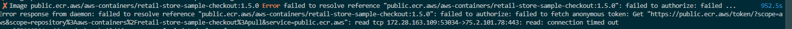
 

Solution of error 
sudo nano /etc/wsl.conf
[network]
generateResolvConf = false

save and exit 
wsl –shutdown

start WSL and then test access

curl https://public.ecr.aws/token/

if response comes, fixed.

After resolve error then it was working 
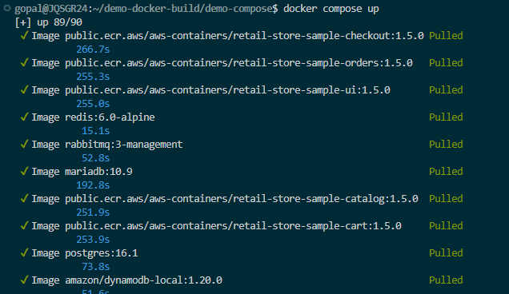

Test the Application
http://localhost:8888/

 

http://localhost:8888/topology
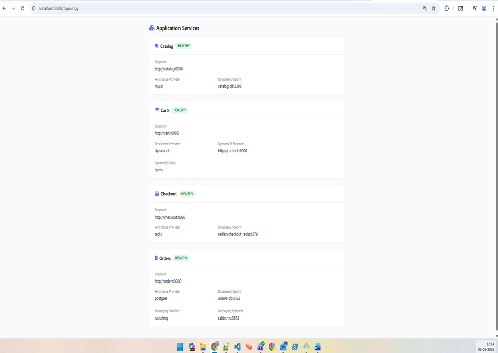
 

docker compose log 
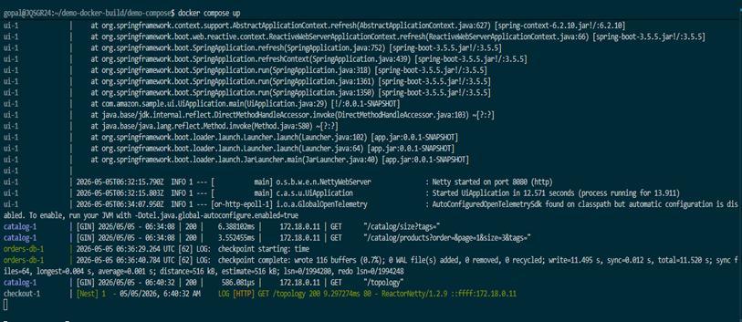
 

docker compose watch
copies changes files into container 
Rebuild image when dependency files change
restart service when config files change

How it works

watch rules in your docker-compose.yml
services:
  web:
    build: .
    develop:
      watch:
        - action: sync
          path: .
          target: /app

Then run 

docker compose watch 
When local files change, Docker syncs them into /app.

service wise log check command 
docker compose logs -f checkout 
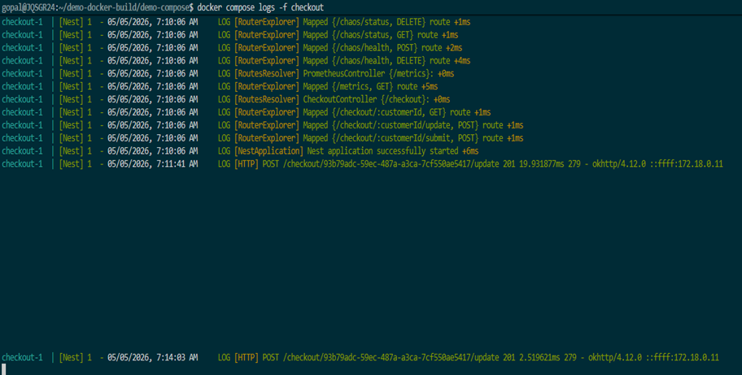

 

Display live stream of container resource usage
Docker compose stats
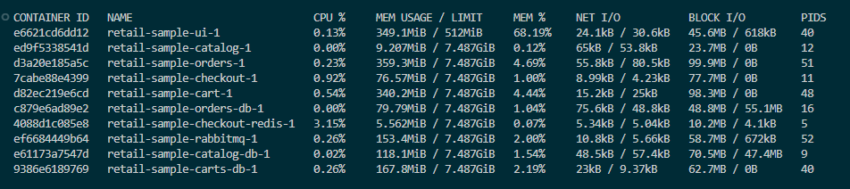
 
	
Display the running process of all service containers
docker compose top 

Environment Varibles: Verify UI Service Container before changes

# Connect to UI Container 
docker compose exec ui sh
# Verify Environment Variables in UI Container
env | grep RETAIL

# Exit from UI Container
exit
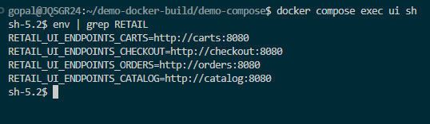

 

Make changes to Docker Compose and Deploy

Before change in UI Container it’s showing default theme
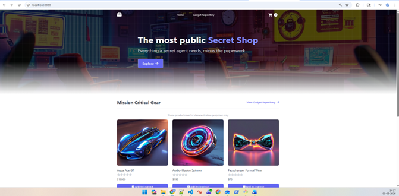
 

Update environment variable for UI container using docker compose file.
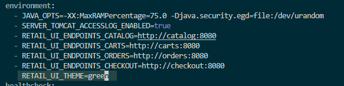
 

docker compose up -d –force-recreate ui
 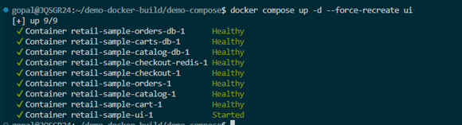

docker compose exec ui env | grep RETAIL
 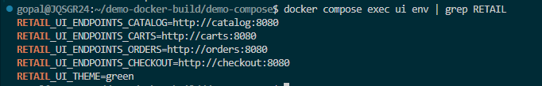

After recreate container theme is change
 

Assignment
Currnet Retail UI theme is green
 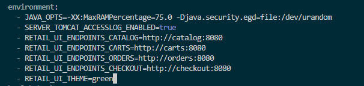

Before change theme
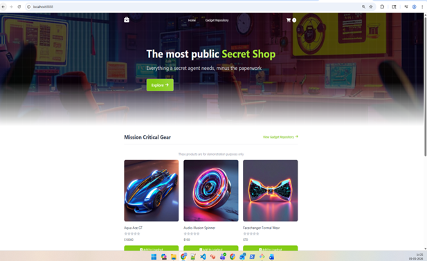
 

Change theme Green to Orange modify docker compose file.
 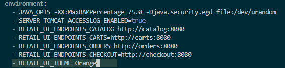

Recreate container 
docker compose up -d –force-recreate ui
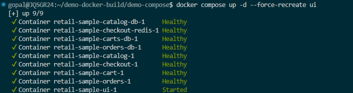
 

docker compose exec ui env | grep RETAIL now it’s showing Orange theme
 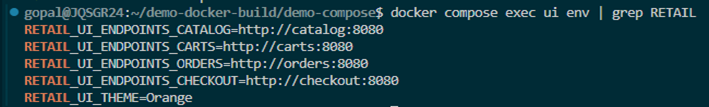

now it’s showing orange theme in UI
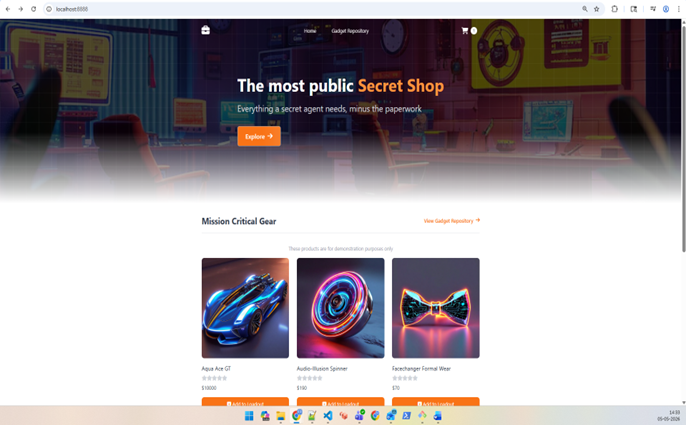
 

Clean system
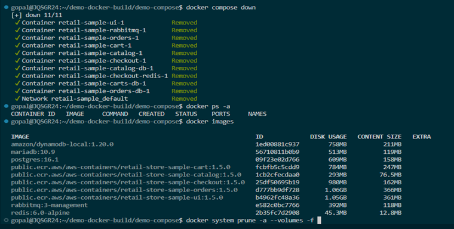 

Docker_Buildx

How to build multiplatform docker images 
Qemu Emulator
Docker buildx command

Install binfmt/QEMU emulators (cross-arch)
# Reinstall QEMU binfmt handlers
docker run --privileged --rm tonistiigi/binfmt --install all

# OR explicitly for arm64 + amd64
docker run --privileged --rm tonistiigi/binfmt --install arm64,amd64

Create a containerized Buildx builder (multi-arch capable)
# Create a new multiarch builder that uses BuildKit in a container
docker buildx create --name multiarch --driver docker-container --use

# Bootstrap to detect all supported platforms
docker buildx inspect --bootstrap

# List Buildx Builders
docker buildx ls

Docker Hub login & variables
export DOCKERHUB_USER="asd99557"  
 

export DH_REPO="retail-ui-multiarch"  

---- DERIVED ----
export IMAGE="${DOCKERHUB_USER}/${DH_REPO}:${TAG}"
echo $IMAGE

Login to Docker Hub (will prompt for password or PAT)
docker login -u "${DOCKERHUB_USER}"

Use your Dockerfile (Retail Store UI)
Create a Folder
mkdir demo-multiarch
cd demo-multiarch

Download the Application Source
wget https://github.com/aws-containers/retail-store-sample-app/archive/refs/tags/v1.3.0.zip

Unzip Application Source
unzip v1.3.0.zip

Change Directory to UI Source folder
cd retail-store-sample-app-1.3.0/src/ui
cat Dockerfile

Build & push multi-platform image (AMD64 + ARM64)
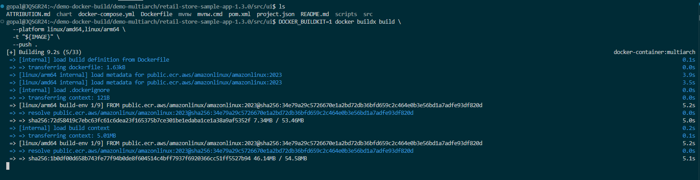
 
 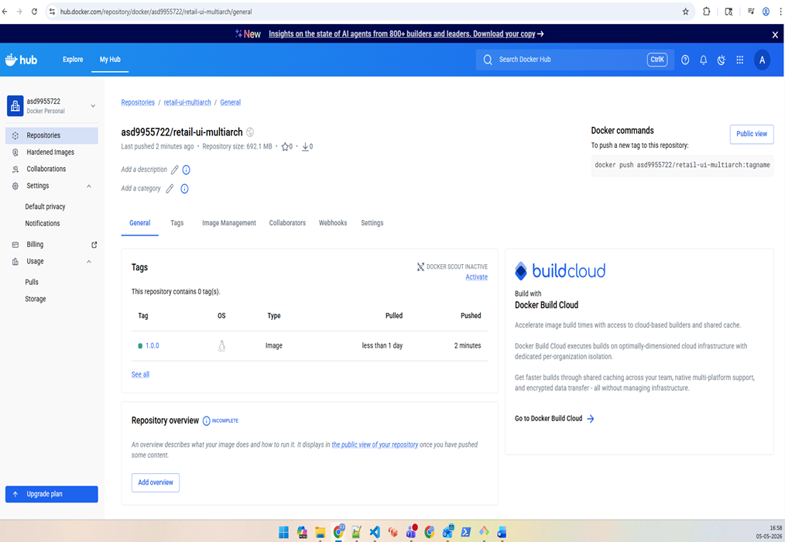

 

