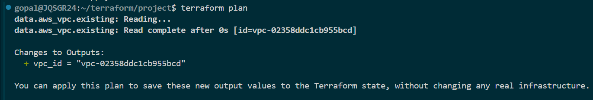
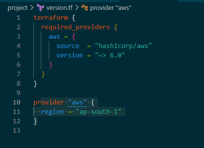
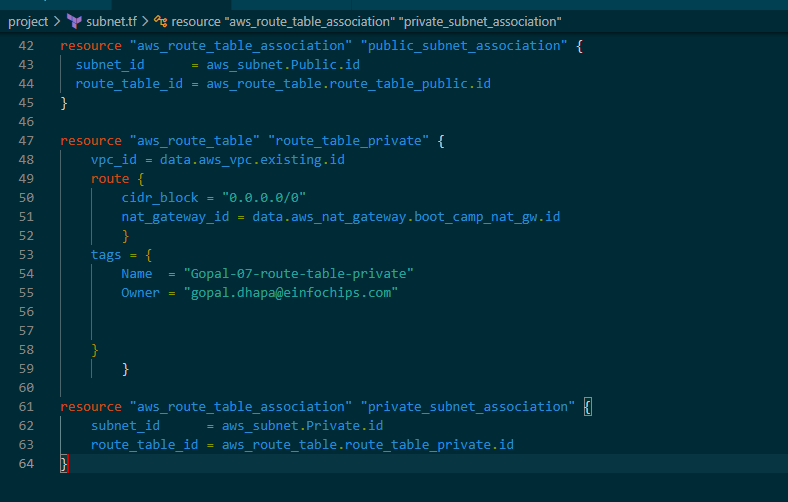
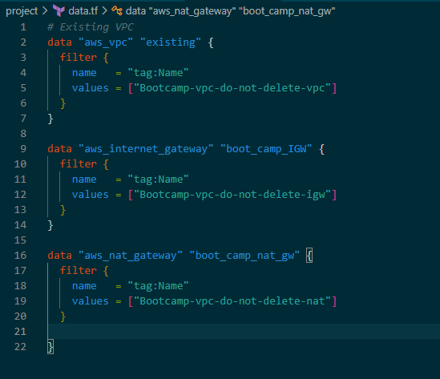
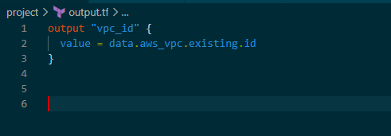
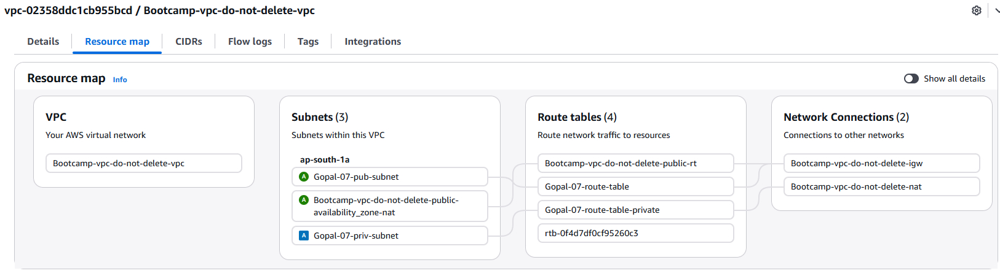

### Terrafom

- why we need terraform

1) Manual Provisioning
2) Scripts (Bash, Python, Aws CLI)
3) AWS Cloudformation


- Terraform
1) Consistency across environments
2) Reusable code
3) collabaration
4) Predictability
5) Scalability
6) Portability


## Teraform installtion Step

- install AWS cli

- install Vs code studio

- Window OS installtion

- Download TF binary 

- Copy binary and create one folder past it there.

- copy that path and and edit environment varialble 

- click on user variables click on path option then

 - select new option enter your path in this option click on ok option.

- reopen command prompat and run terrafrom version

- Install Terraform for linux using dnf package


- Unserstend terraform execution flow


## Terraform Block
- Resource blocks
- provider block
- outputs block

## Terraform command 

```bash
Terraform init
Terraform validate
terraform plan
terraform apply
terraform destroy
terrafrom outpute
```
## terraform execution flow

- Terraform cli >  execution plan & resource definitions > AWS API calls 

- Read .tf files, validate it plan and apply
 Translates terraform config into aws API calls
create, updates and manages aws resources


- Terraform init command it will download provider and it will call to the aws API. 

- Validate command it will validate syntaxt of TF file

- Terraform plan: it will show plan

- Terraform apply it will create resource translate TF file and call API to create resource in aws.

- Also verify the authentication credentials configured in your local desktop

- `Terraform destroy use for delete resource`


### Terraform Block

in tf files require_version = argument
and required_providers it is in flower brackets {}
- ~> 6.0.1 : Allow updates within the same major version range starting at 6.0.X

- >= 6.0 :  Allow any version 6.0 or higher (including future major versions)

- Random provider 
 Used to genrate random values.

- Provider block


- Strings are single pieces of text,
- Example"us-east-1"
- Like non collcation value.  names, IDs, or CIDR blocks
- Example: variable "region" { type = string }

- Lists are ordered sequences of values,
Example: ["a", "b", "c"]
Defining a list of availability zones or security group IDs where you might want to pick the "first" or "second" one.

- Maps are collections of key-value pairs
  Example:  { env = "prod" }


## Resource block
- lable like first one is showing resource type and second one is local name
- use for refrence purpose which is use in another resource 

- Argument refrence: which is before creating the resource you provide the configuration information.
attribute refrence: after the resource is created, metadata of that resource.

## Output block


## terraform init
- Download the provider plugin prepare working directory 
and it will create .terraform.lock.hcl file that record the exect version of TF.

- Terraform validate
  it will not connect to AWS only validate configuration


## Using Data block
Fetch existing vpc 



## Created Subnet as well as fetch related resource details.
- internet_gateway
- nat_gateway
- public_subnet_ids
- route_table_id






