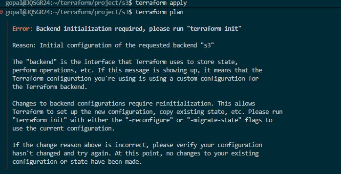
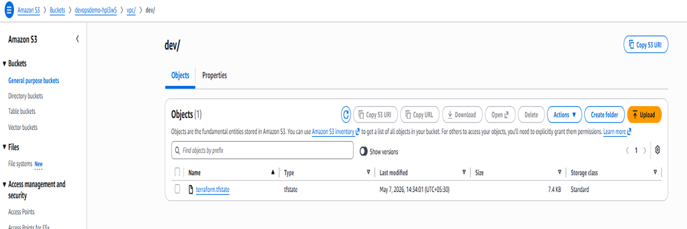

## Terraform Concepts 
- Terraform Block
- Provider Block
- Input Variables
- Local Values
- Data Sources
- Resource Blocks
- Outputs
- State files (local)
- Basic Terraform commands: init, validate, plan, apply, destroy


## Create vpc with public and private subnet
- vpc 
- 3 Availability zone
- 3 public subnet
- 1 Nat Gateway (created in public subnet)
- 3 private subnet

    created nat gateway in public subnet because if we want to communicate to private subnet internet outbound then it goes vai this natgateway and goes to IG.
- 1 Internet Gateway 
- 1 Ec2 instance in public subnet and another one Ec2 instance create in private subnet


## Terraform variables
- insted of hardcoded valu using variable file keepin our setup clean reusable and dry
- Declares input variables used throught the config
- Precedence of terraform variables
- -var and -var-file:   TF plan -var-file=pord.tfvars
- *.auto.tfvars: auto-loaded: auto-loaded, overrides terraform.tfvars
- Terraform.tfvars: (Auto-loaded if present in working dir)
- Environmnet variables: TF_VAR_aws_region=us-east-2
- Default values specified in variables.tf

## Data source 
Terraform data source is a read-only bridge that allows your configuration to fetch information from external systems or existing infrastructure. Unlike managed resources, which create or modify infrastructure, data sources only retrieve data for reference, helping you build dynamic configurations without hardcoding

## Local Block
Locals block allows you to define internal, named expressions or variables that can be reused throughout a single module. They are similar to function-scoped variables in traditional programming: you define them once and reference them multiple times to keep your code DRY (Don't Repeat Yourself).
- Slice Function 
- slice extracts some consecutive elements from within a list.

slice(list, startindex, endindex)

startindex is inclusive, while endindex is exclusive. This function returns an error if either index is outside the bounds of valid indices for the given list.

Examples

``` 
slice(["a", "b", "c", "d"], 1, 3)
[
  "b",
  "c",
]
``` 


cidrsubnet Function
cidrsubnet calculates a subnet address within given IP network address prefix.

``` 
cidrsubnet(prefix, newbits, netnum) 
cidrsubnet("10.0.0.0/16", 8, 0)

VPC CIDR block then how many bits require like 24 require then use 8 bits 
16+8 it is 24 bits  then provide netnum means 0 
"10.0.0.0/24"
"10.0.1.0/24"
"10.0.2.0/24"
```

## Terraform merge 
Multiple maps into a single map all the values into a single map

- Use for tag managment 

## Meta-arguments 
- Meta-arguments
Meta-arguments are a class of arguments built into the Terraform configuration language that control how Terraform creates and manages your infrastructure

- depends_on: explicit dependency
- count: 	  create multiple copies
- for_each:   create resources from map/set
- provider:	  choose provider configuration
- lifecycle:  control create/update/destroy behavior
- values takes a map and returns a list containing the values of the elements in that map.
```
> values({a=3, c=2, d=1})
[
  3,
  2,
  1,
] 
```
## Remote Backend Demo
- versioning
- collaboration
- state locking
- security = iam policy 
- server side enable encryption by default
- Prevent destory= True







## Terraform Module
- Root module: The root module is the directory where you run Terraform commands, 

- Chaild modules: root modules called another modukes is chailed modules
