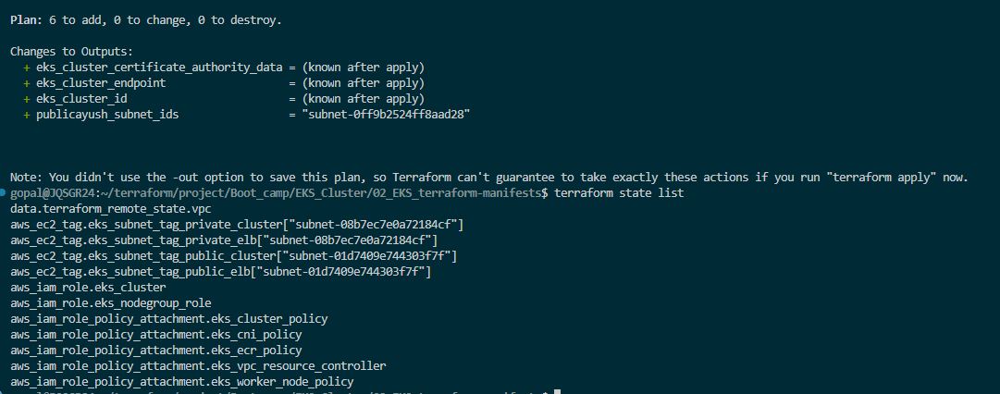

### Kubernetes Architecture
Kubernetes architecture is mainly divided into:

1. Control Plane (Master Components)
2. Worker Nodes

## 1. Control Plane Components
- API Server: Main entry point for all commands.
- ETCD: Distributed key-value database storing cluster state.
- Scheduler: Decides where pod should run.
- Controller Manager: Keeps desired state.

## 2. Worker Node Components
- These run application workloads.
- Kubelet: Agent on each node.
- Kube Proxy: Handles networking and service routing.
- Container Runtime: Runs containers.
- Pods:Smallest deployable unit in Kubernetes.

Contain one or more containers.

How it Works 

```
kubectl apply deployment.yaml
↓
API Server receives request
↓
ETCD stores desired state
↓
Scheduler selects node
↓
Kubelet starts pod
↓
Kube Proxy exposes networking
```


## Terraform Remote State Datasource for VPC and EKS Cluster Terraform Projects

- In Terraform, a remote state data source is used to read outputs from another Terraform state file stored in a backend such as:

- Why use it
1) Network project created
- vpc 
- subnets
- security groups

2) EKS project needs:
- Vpc ID
- Subnet ids
Instead of hardcoding values, read them from remote state.

```
Reads remote tfstate
↓
Loads outputs only
↓
Uses values in current project
```

## Steps to Provision
- Terraform init
- Terraform validate
- Terraform Plan
- Terraform Apply

## Configure kubectl cli to access EKS cluster
-  EKS kubeconfig: aws eks update-kubeconfig --name <cluster_name> --region <aws_region>

- List Kubernetes Nodes
kubectl get nodes

- List Kubernetes Pods 
kubectl get pods -n kube-system

## Browse EKS Cluster features on AWS Console


## Creating EKS cluster 
- Terraform Plan

