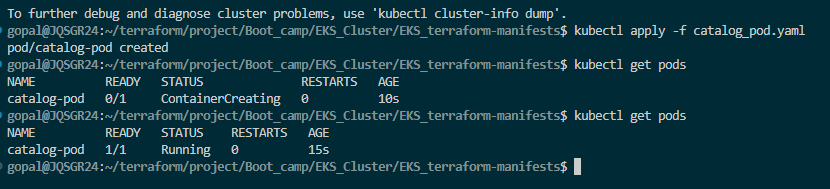
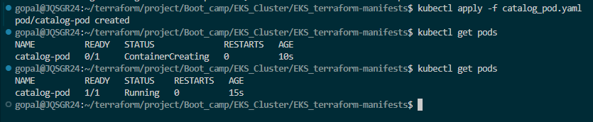
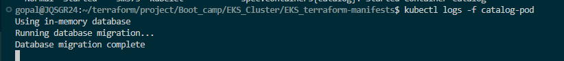
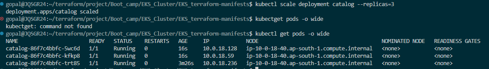
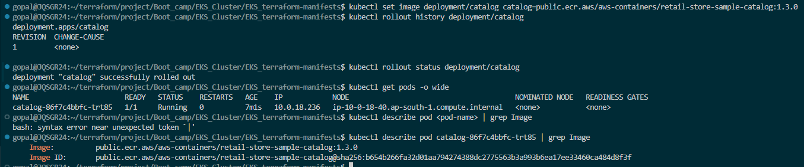
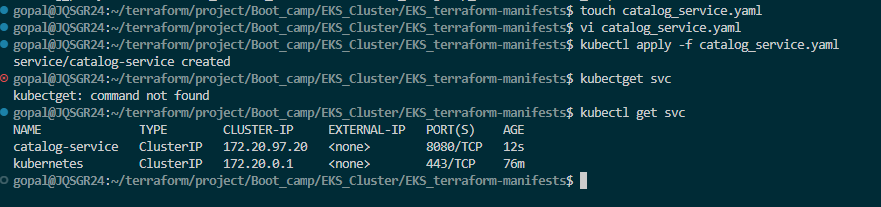

## Kuberntes Pod
- Pod
- Deployment
- service
- Config Map
- Statefull state
- Empty dir

## Pod
- Smallest Deployment unit in kuberntes
- Create pod and pod runs container inside it.
- kuberntes scheduler will deside which node pod will run 
- Sidecar container: sidecar runs alongside the main application container for the lifetime of the Pod
- usage for : Logging agents, Proxy containers, Monitoring agents

```
Pod starts
├── Main container starts
└── Sidecar starts
Both run together
```
- init container runs before the main container starts, completes a task, then exits.
- Usage for :Download config files, Wait for DB readiness


## POD YAML
```
apiVersion: v1
kind: Pod
metadata:
  name: catalog-pod
  labels:
    app: catalog
spec:
  containers:
    - name: catalog
      image: "public.ecr.aws/aws-containers/retail-store-sample-catalog:1.3.0"
      ports:
        - name: http
          containerPort: 8080
          protocol: TCP
      resources:
        requests: 
          cpu: "100m"
          memory: "128Mi" 
        limits:   
          cpu: "250m"
          memory: "256Mi"
      readinessProbe:
        httpGet:
          path: /health
          port: 8080
```

created Pod



- Readiness Probe is used to check whether a container is ready to receive traffic.

If the readiness probe fails, the Pod keeps running, but Kubernetes removes it from Service endpoints so it does not receive requests.
-LivenessPod: App healthy/alive

## Kuberntes API

## Kubernetes Deploy pod and verify
```
kubectl apply -f 01_catalog_pod.yaml
```


- Kubectl descirbe pod 
- kubectl logs -f catalog-pod



- Expose the Pod locally using:
- kubectl port-forward pod/catalog-pod 7080:8080
- kubectl exec -it catalog-pod -- sh


## Kubernetes Deployment
- Replicast: ReplicaSet is a Kubernetes controller that ensures a desired number of Pod replicas are always running by automatically replacing failed or deleted Pods.
- HPA: Horizontal Pod Scaling using Cpu memory matrics scaling.
- Rolling update: Rolling Update is a deployment strategy where old Pods are replaced with new Pods gradually, not all at once.
- Self-healing, and Roll Back means reverting an application deployment to a previous working version if a new release causes issues.
- 

```
apiVersion: apps/v1
kind: Deployment
metadata:
  name: catalog
  labels:
    app.kubernetes.io/name: catalog
spec:
  replicas: 1
  strategy:
    rollingUpdate:
      maxUnavailable: 1
    type: RollingUpdate
  selector:
    matchLabels:
      app.kubernetes.io/name: catalog
  template:
    metadata:
      labels:
        app.kubernetes.io/name: catalog
    spec:
      securityContext:
        fsGroup: 1000
      containers:
        - name: catalog
          securityContext:
            capabilities:
              drop:
              - ALL
            readOnlyRootFilesystem: true
            runAsNonRoot: true
            runAsUser: 1000
          image: "public.ecr.aws/aws-containers/retail-store-sample-catalog:1.3.0"
          imagePullPolicy: IfNotPresent
          ports:
            - name: http
              containerPort: 8080
              protocol: TCP
          readinessProbe:
            httpGet:
              path: /health
              port: 8080
          livenessProbe:
            httpGet:
              path: /health
              port: 8080
          resources:
            limits:
              cpu: 200m
              memory: 256Mi
            requests:
              cpu: 100m
              memory: 256Mi
```
- Resource Request: Minimum guaranteed resources a container asks for.
- Resource Limit: Maximum resources a container is allowed to consume.
- Resource requests define the minimum CPU and memory needed for scheduling, while resource limits define the maximum CPU and memory a container can consume at runtime.

## Deploy the catelog
```
kubectl apply -f 01_catalog_deployment.yaml

kubectl scale deployment catalog --replicas=3
```



Deployment > ReplicaSet > Pod


## Rollback to Previous Version (1.0.0)
```
kubectl rollout undo deployment/catalog
```

- Check the version after rollback:




``` 
kubectl describe deployment catalog | grep Image
```

## Kuberntes Services
- Cluster ip:
- Nodeport:
- load balancer:
- External name:
- headless service:

- Cluster IP: Internall communication for cluster 
- Kubernetes uses the selector labels in the Service definition to automatically discover Pods that match those labels. It then creates an EndpointSlice object listing the Pod IPs and ports that belong to that Service.

## Create ClusterIP Service
```
apiVersion: v1
kind: Service
metadata:
  name: catalog-service
  labels:
    app.kubernetes.io/name: catalog
spec:
  type: ClusterIP
  selector:
    app.kubernetes.io/name: catalog
  ports:
    - name: http
      port: 8080
      targetPort: 8080
      protocol: TCP
```

```
kubectl apply -f 02_catalog_clusterip_service.yaml
kubectl get svc
kubectl describe svc catalog-service
```



## Config Map
- ConfigMap = Store non-sensitive config outside container image such as environment variables, command arguments, and configuration files.

- Create ConfigMap
```
apiVersion: v1
kind: ConfigMap
metadata:
  name: catalog
data:
  RETAIL_CATALOG_PERSISTENCE_PROVIDER: "in-memory"
  RETAIL_CATALOG_PERSISTENCE_ENDPOINT: ""
  RETAIL_CATALOG_PERSISTENCE_DB_NAME: "catalogdb"
  RETAIL_CATALOG_PERSISTENCE_USER: "catalog_user"
  RETAIL_CATALOG_PERSISTENCE_PASSWORD: ""
  RETAIL_CATALOG_PERSISTENCE_CONNECT_TIMEOUT: "5"
```