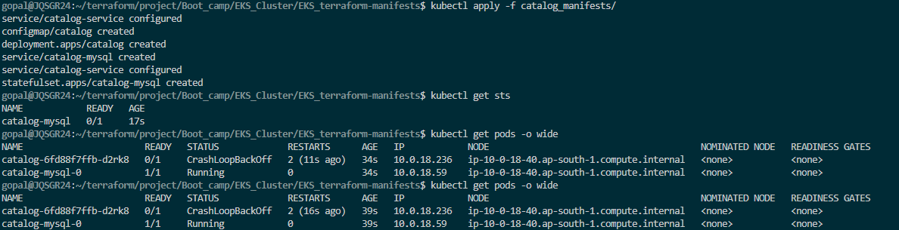
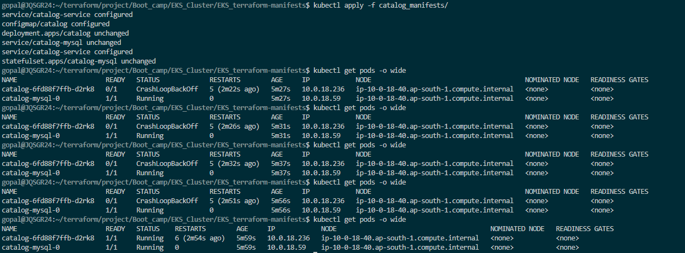
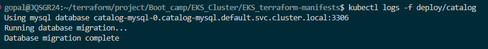
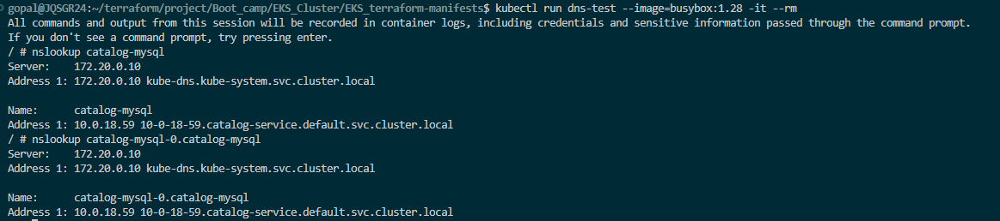
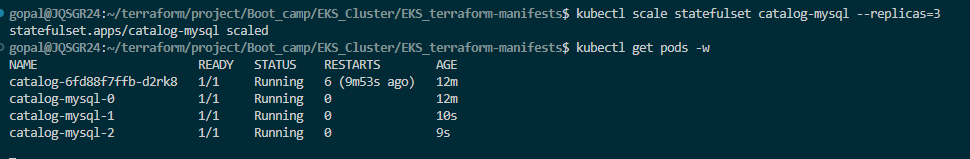
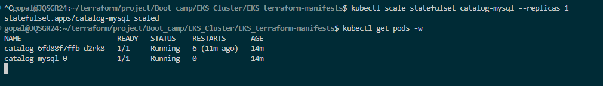

## Statefulset
- Headless services: Direct connect to pod using DNS (Create DNS entry at pod level)
- Addtional value mantioned clusterIP:none 
- Creating headless service using this format
: Podname > Headless-service > namespace.svc > cluster-domain.example

- Create Headless Service

- Deploy MySQL StatefulSet
- Apply All Manifests

- Verify Catalog App Logs – Ensure It Connects to MySQL Database

- Test DNS Resolution

- Scale Up – Ordered Pod Creation

- Scale Down – Reverse Order Deletion
