## Kubernetes Secrets
- Secret is an object designed to store small amounts of senstitive data such as passwords token,s or keys

- Secret = Password
- ConfigMap = Settings
- StatefulSet = DB
- Deployment = App


- Kubernetes Secrets – Secure MySQL Credentials
- Create Secret for MySQL Credentials
- refrence secret in mysql statefulset
- update configmap
- refrence secret in deployment
- apply manifests and verify


## Types Of Secrets
- Opaque: The default type for general-purpose user-defined data (e.g., database passwords).
- Kubernetes.io/service-account-token: Used to store tokens that identify a service account to the API server.
- kubernetes.io/dockerconfigjson: Stores credentials for authenticating with a private container registry to pull images.
- kubernetes.io/tls: Specifically used for storing a certificate and its associated private key for TLS encryption.


## Create and managing Secrets
- Command Line Example:
```
kubectl create secret generic my-secret --from-literal=password=S3cr3t!
```
- Viewing Secrets:
kuebctl get secrets

- Pod Identity Agent: Pod Identity Agent = EKS component that delivers IAM credentials to POD

How It works

```
Pod
 ↓ uses service account
EKS Pod Identity association
 ↓
Pod Identity Agent on node
 ↓
Temporary IAM credentials
 ↓
AWS API access
```

- Components
1. IAM Role

 Create role with required permissions.

2. Kubernetes Service Account

Pod runs using service account.

3. Pod Identity Association

Maps service account ↔ IAM role.

4. Pod Identity Agent

Runs on worker nodes and helps deliver credentials.


Run As : DaemonSet

## Secrets Demo (Kubernetes Secrets – Secure MySQL Credentials)

- Create Secret for MySQL Credentials
- Reference Secret in MySQL StatefulSet
- Update ConfigMap
- Reference Secret in Deployment
- Apply Manifests and Verify
- kubectl get secrets
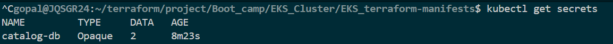

- kubectl describe secret catalog-db
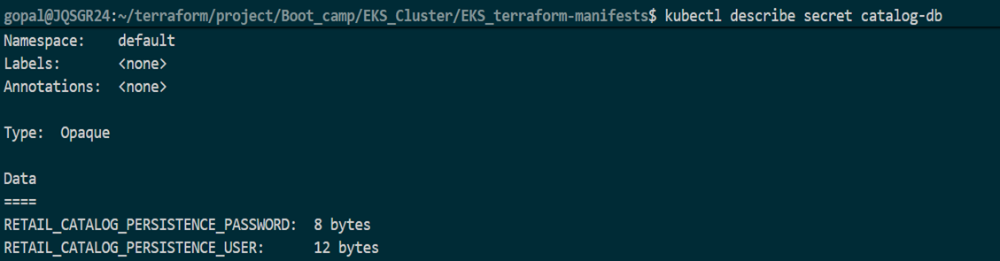

- kubectl get secret catalog-db -o yaml
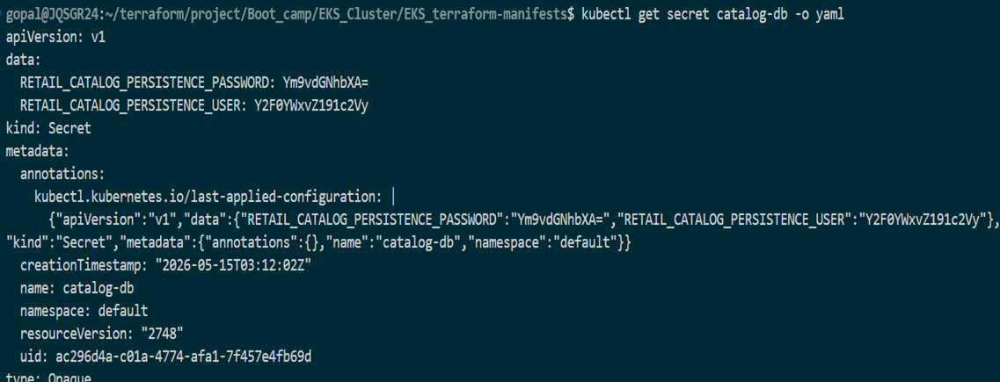
- Port-forward Catalog Pod
- kubectl port-forward svc/catalog-service 7080:8080
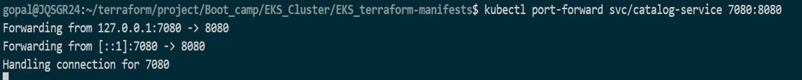


Test Endpoints:
- http://localhost:7080/topology: Check service topology
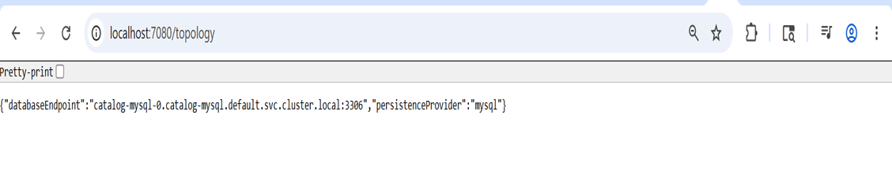

- http://localhost:7080/health: Health check
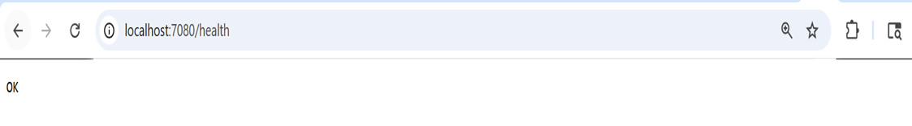

- http://localhost:7080/catalog/products: List all products
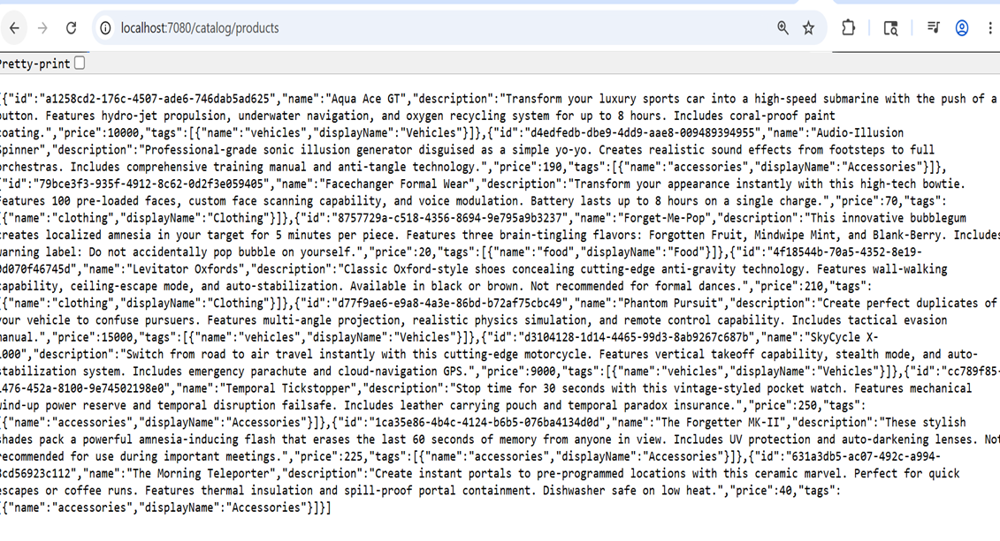


## EKS-pod-agent-Demo
- Install EKS Pod Identity Agent
1) Open EKS Console → Clusters → select your cluster (eksdemo1)
2) Go to Add-ons → Get more add-ons
3) Search for EKS Pod Identity Agent
4) Click Next → Create

- kubectl get daemonset -n kube-system
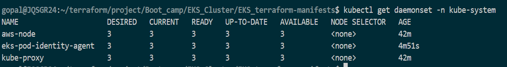

- kubectl get pods -n kube-system
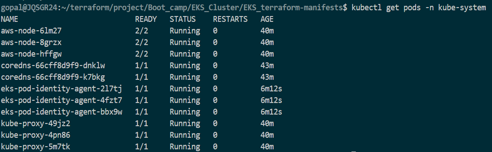


- Deploy AWS CLI Pod (without Pod Identity Association)

- kubectl get pod 
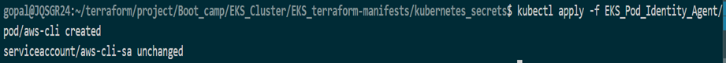

- Exec into the pod and try to list S3 buckets:

```
kubectl exec -it aws-cli -- aws s3 ls
```
Observation: ❌ This should fail because no IAM permissions are associated with the Pod.
- Create IAM Role for Pod Identity
1) Go to IAM Console → Roles → Create Role
2) Select Trusted entity type → Custom trust policy
3) Add trust policy for Pod Identity, for example:
```
{
    "Version": "2012-10-17",
    "Statement": [
        {
            "Effect": "Allow",
            "Principal": {
                "Service": "pods.eks.amazonaws.com"
            },
            "Action": [
                "sts:AssumeRole",
                "sts:TagSession"
            ]
        }
    ]
}
```
4) Attach AmazonS3ReadOnlyAccess policy
5) Create role → example name: EKS-PodIdentity-S3-ReadOnly-Role-101


- Create Pod Identity Association

Go to EKS Console → Cluster → Access → Pod Identity Associations

- Create new association:

1) Namespace: default
2) Service Account: aws-cli-sa
3) IAM Role: EKS-PodIdentity-S3-ReadOnly-Role-101
4) Click on create

- Test Again
- Restart Pod
```
kubectl delete pod aws-cli -n default
```
- Create Pod
```
kubectl apply -f kube-manifests/02_k8s_aws_cli_pod.yaml
```
List Pods
```
kubectl get pods
```
Exec into the Pod:
```
kubectl exec -it aws-cli -- aws s3 ls
```

# List S3 buckets
kubectl exec -it aws-cli -- aws s3 ls
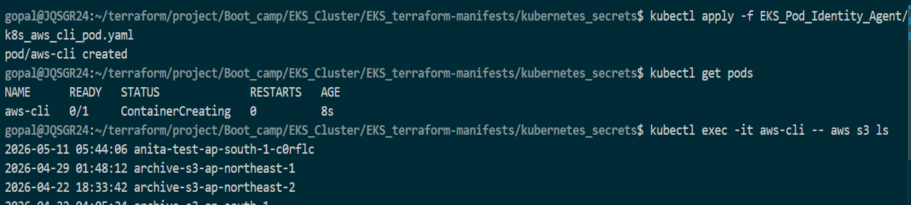

## AWS Secrets and Configuration Provider (ASCP) for Amazon EKS 

- why helm and what are it's benifits.
- Reusability,Versioning, Release managment, Packaging and sharing, consistancy, Helm repositories

- Install Helm CLI and Add Helm Repositories
- Install Helm CLI
- Add Helm Repositories 
- Install the Secrets Store CSI Driver
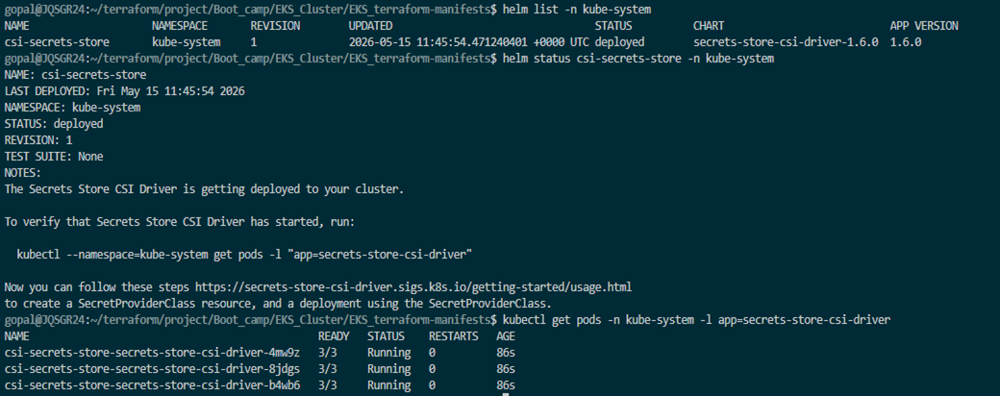
- Install the AWS Secrets and Configuration Provider (ASCP)
- Install the AWS Provider
- Verify Installation
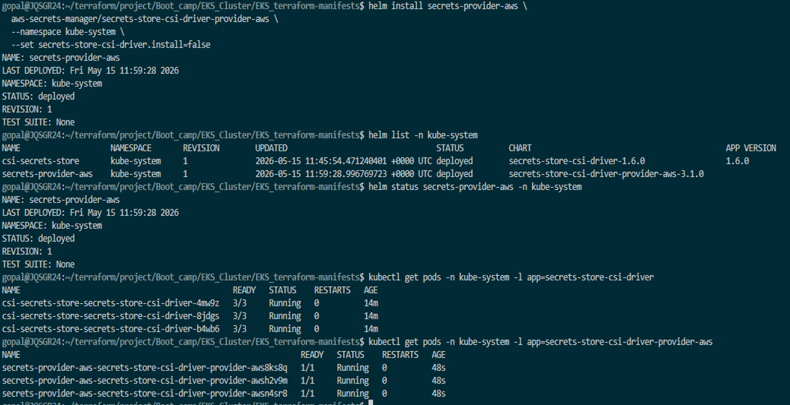
- Verify DaemonSets
- Troubleshooting
- Optional: List All Resources Created by the AWS Provider
- Create IAM Role, Policy and EKS Pod Identity Association
- Export Environment Variables
- Create IAM Policy
- Create IAM Role for Pod Identity
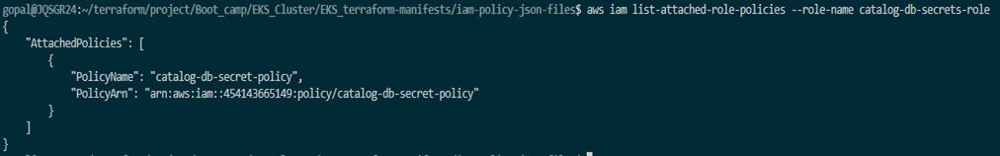
- Create Pod Identity Association
- Verify Pod Identity Association
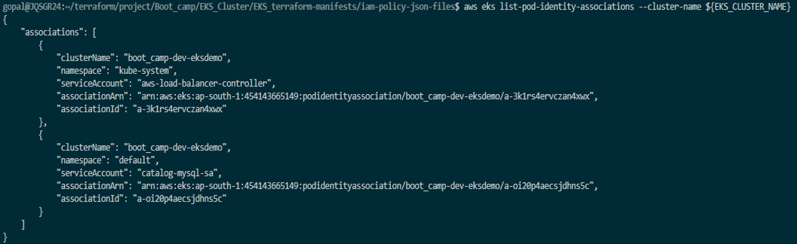
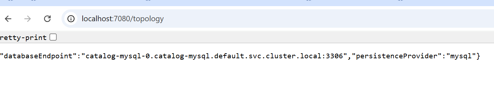

- Connect to MySQL Database using MySQL Client Pod
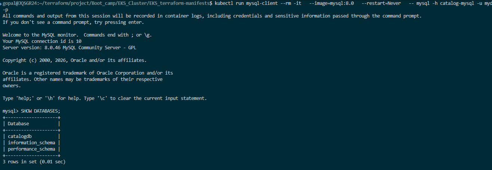

 ## Integrate AWS Secrets Manager with Catalog Microservice (EKS Pod Identity)

Learning objective


- Create an AWS Secrets Manager secret (catalog-db-secret-1) with MySQL credentials.
- Define a SecretProviderClass that retrieves this secret using EKS Pod Identity.
- Update both the MySQL StatefulSet and Catalog Deployment to mount and use these secrets.
- Achieve no plaintext credentials or Kubernetes Secrets stored in etcd.

- Create AWS Secret in Secrets Manager
- Create the SecretProviderClass
- Create the ServiceAccount
- Update the MySQL StatefulSet
- Update the Catalog Microservice Deployment
- Apply All Kubernetes Manifests
- Verify if Secrets mounted in pods or not
- Verify Catalog Microservice Application
- Connect to MySQL Database and Verify


## Setup IAM Policy, ROLE, EKS PIA Association

## Create AWS Secret manager secret and review secretprovider class

