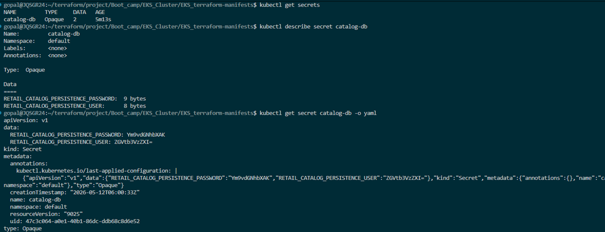

## Kubernetes Secrets
- Secret is an object designed to store small amounts of senstitive data such as passwords token,s or keys

- Secret = Password
- ConfigMap = Settings
- StatefulSet = DB
- Deployment = App


- Kubernetes Secrets – Secure MySQL Credentials
- Create Secret for MySQL Credentials
- refrence secret in mysql statefulset
- update configmap
- refrence secret in deployment
- apply manifests and verify




## Types Of Secrets
- Opaque: The default type for general-purpose user-defined data (e.g., database passwords).
- Kubernetes.io/service-account-token: Used to store tokens that identify a service account to the API server.
- kubernetes.io/dockerconfigjson: Stores credentials for authenticating with a private container registry to pull images.
- kubernetes.io/tls: Specifically used for storing a certificate and its associated private key for TLS encryption.


## Create and managing Secrets
- Command Line Example:
```
kubectl create secret generic my-secret --from-literal=password=S3cr3t!
```
- Viewing Secrets:
kuebctl get secrets

- Pod Identity Agent: Pod Identity Agent = EKS component that delivers IAM credentials to POD

How It works

```
Pod
 ↓ uses service account
EKS Pod Identity association
 ↓
Pod Identity Agent on node
 ↓
Temporary IAM credentials
 ↓
AWS API access
```

- Components
1. IAM Role

 Create role with required permissions.

2. Kubernetes Service Account

Pod runs using service account.

3. Pod Identity Association

Maps service account ↔ IAM role.

4. Pod Identity Agent

Runs on worker nodes and helps deliver credentials.


Run As : DaemonSet


## EKS-pod-agent-Demo


## AWS Secrets and Configuration Provider (ASCP) for Amazon EKS 

- why helm and what are it's benifits.
- Reusability,Versioning, Release managment, Packaging and sharing, consistancy, Helm repositories

- Install Helm CLI and Add Helm Repositories
- Install Helm CLI
- Add Helm Repositories 
- Install the Secrets Store CSI Driver
- Install the AWS Secrets and Configuration Provider (ASCP)
- Install the AWS Provider
- Verify Installation
- Verify DaemonSets
- Troubleshooting
- Optional: List All Resources Created by the AWS Provider
- Create IAM Role, Policy and EKS Pod Identity Association
- Export Environment Variables
- Create IAM Policy
- Create IAM Role for Pod Identity
- Create Pod Identity Association
- Verify Pod Identity Association
- Verify in Kubernetes
 

 ## Integrate AWS Secrets Manager with Catalog Microservice (EKS Pod Identity)

Learning objective


- Create an AWS Secrets Manager secret (catalog-db-secret-1) with MySQL credentials.
- Define a SecretProviderClass that retrieves this secret using EKS Pod Identity.
- Update both the MySQL StatefulSet and Catalog Deployment to mount and use these secrets.
- Achieve no plaintext credentials or Kubernetes Secrets stored in etcd.

- Create AWS Secret in Secrets Manager
- Create the SecretProviderClass
- Create the ServiceAccount
- Update the MySQL StatefulSet
- Update the Catalog Microservice Deployment
- Apply All Kubernetes Manifests
- Verify if Secrets mounted in pods or not
- Verify Catalog Microservice Application
- Connect to MySQL Database and Verify


## Setup IAM Policy, ROLE, EKS PIA Association

## Create AWS Secret manager secret and review secretprovider class

