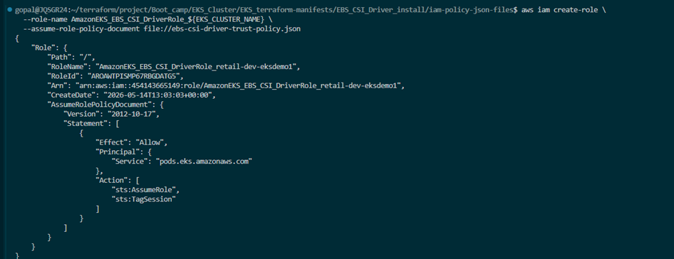
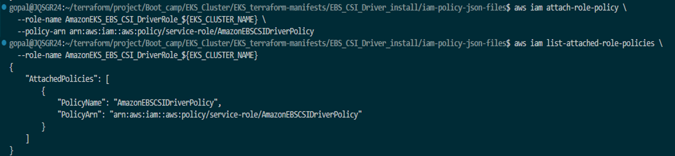
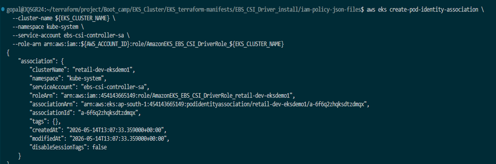
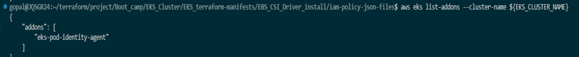
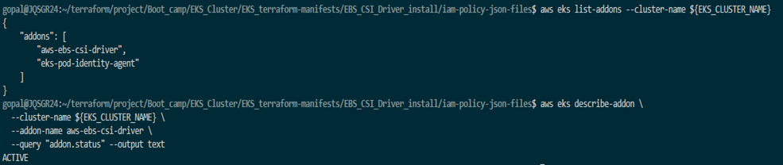
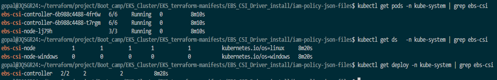
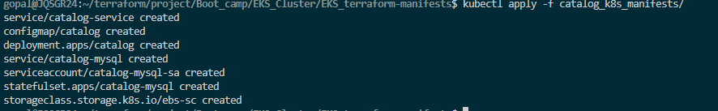
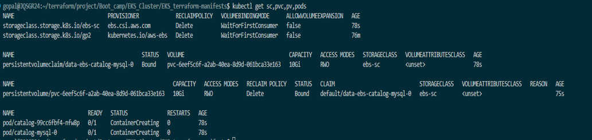

## EBS Persistence volume 
- Persistent Volume provides durable storage independent of the pod lifecycle.
- Empty Dir: temporary
- EBSCSI: permanent

- The primary reasons for using Persistent Volumes include:
1) Data Durability: Critical for stateful applications like databases (e.g., MySQL, PostgreSQL) where data must survive even if the underlying infrastructure or Pod fails.
2) Decoupling Storage from Pods: Standard volumes are tied to a Pod's lifecycle; PVs are independent cluster resources, much like a node.
3) Infrastructure Abstraction: Developers can request storage via a PersistentVolumeClaim (PVC) without needing to know the technical details of the underlying storage backend (like AWS EBS, NFS, or local disk).
4) Data Sharing: Certain PV configurations allow multiple Pods to access and share the same set of data simultaneously across the cluster.

## Liefecycle of a volume and claim

- Provisioning: There are two ways PVs may be provisioned: statically or dynamically.

- Static: A cluster administrator creates a number of PVs. They carry the details of the real storage, which is available for use by cluster users. They exist in the Kubernetes API and are available for consumption.

- Dynamic: Dynamic StorageClass is a StorageClass that automatically provisions storage when a PersistentVolumeClaim (PVC) is created,
- Without dynamic provisioning:
    1) Admin creates PV manually
    2) User creates PVC
    3) PVC binds to PV

- With dynamic provisioning:

    1) User creates PVC
    2) StorageClass automatically creates PV through CSI driver
    3) PVC gets bound automatically

## EBS CSI, Driver
- Sc: When a PVC requ , it usually creates a PersistentVolumeClaim (PVC).
    1) The StorageClass tells Kubernetes:

    2) Which storage provider to use
    3) What disk type to create
    4) Performance settings
    5) Reclaim behavior
    6) When to create volume

- PV:  PersistentVolume (PV) is a piece of storage in the cluster that has been provisioned by an administrator or dynamically provisioned using Storage Classes. SC and PVC is cluster level resoruces. 
- PVC: Persistent volume claim is namespace spacific resource 

- EBS CSI Controller: it's daemon set runing in each worker node. Hanedel provisiong in deatache operations of a volume ,formating file system, publishing volume to container.
- Example: 
  1) Pod scheduled on node A:
  2) EBS volume attached to EC2 node A
  3) EBS CSI Node mounts it to /var/lib/kubelet/...

- CSI node plugin ( Control-palnce storage lifecycle): create  ebs volume, delete ebs volume, Attache volume request,
When you create a PVC, Kubernetes asks the controller to provision storage.
- Example: 
    1) PVC requests 20Gi:
    2) Controller calls AWS API
    3) Creates 20Gi EBS disk
    4) Creates PV
    5) Binds PVC

- Ebs-csi controller-sa: Kubernetes ServiceAccount used by the EBS CSI Controller pods.
  - ID badge allowing manager to access AWS systems

- EKS Pod Identity: Amazon EKS, the EKS Pod Identity Add-on is an AWS-managed feature that allows Kubernetes pods to securely get AWS Identity and Access Management permissions without storing AWS access keys inside containers.

## Amazon EBS CSI Driver Install on EKS (with Pod Identity)
- Export Environment Variables
- Create Trust Policy File
- Create IAM Role and Attach Policy

- Create Pod Identity Association (required for CLI install)

- Install the EBS CSI Driver Add-on

- Verify Installation

## AWS EBS CSI_catalog Integration for Catalog Microservice
- Create StorageClass for Amazon EBS
- Update MySQL StatefulSet to Use EBS Storage
- Deploy and Verify Resources

- During configuration getting error
  MountVolume.SetUp failed for volume "aws-secrets" : rpc error: code = Unknown desc = failed to get secretproviderclass default/catalog-db-secrets, error

 ## Storage Intigration

 ## Database intigration for catalog 
- Amazon RDS MySQL Database Integration with Catalog Microservice
- External name service: ExternalName Service is a special type of Service that maps a Kubernetes service name to an external DNS name instead of routing traffic to pods.
